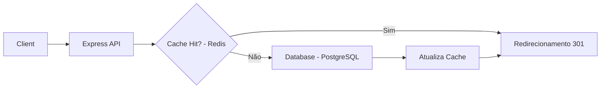

# Short.it - URL Shortener

> Inspirado pela funcionalidade de encurtamento de links do LinkedIn, o **Short.it** é uma API de alta performance desenvolvida em TypeScript para transformar URLs extensas em links curtos, seguros e rastreáveis.

## Índice
- [Sobre o Projeto](#sobre-o-projeto)
- [Funcionalidades](#funcionalidades)
- [Arquitetura e Design](#arquitetura-e-design)
- [Tecnologias Utilizadas](#tecnologias-utilizadas)
- [Endpoints da API](#endpoints-da-api)
- [Decisões de Engenharia](#decisões-de-engenharia)

---

## Sobre o Projeto
Este projeto foi concebido para praticar conceitos avançados de backend, como sistemas de cache distribuído, algoritmos de hashing/encoding e design de sistemas escaláveis. O objetivo principal é fornecer redirecionamentos com latência mínima.

## Funcionalidades
- [x] **Encurtamento de URL:** Transforma links longos em códigos alfanuméricos curtos.
- [x] **Redirecionamento Rápido:** Utiliza Redis para cache de links frequentes.
- [x] **Custom Alias:** Usuários podem escolher um nome personalizado para o link.
- [x] **Estatísticas Básicas:** Contagem de cliques por link.
- [x] **Validação de URL:** Verifica se a URL enviada é válida e acessível.
- [x] **Expiração Automática:** Links podem ter um tempo de vida (TTL) definido.

## Arquitetura e Design
O sistema utiliza uma abordagem de **Clean Architecture**, separando as regras de negócio da infraestrutura.

## Tecnologias Utilizadas
- **Linguagem:** TypeScript
- **Runtime:** Node.js
- **Framework:** Express 
- **Banco de Dados:** MongoDB (Persistência)
- **Cache:** Redis (Alta Performance)
- **ORM:** mongoose
- **Validação:** Zod

### Pré-requisitos
- Node.js instalado

## Endpoints da API

| Método | Endpoint | Descrição |
| :--- | :--- | :--- |
| `POST` | `/api/shorten` | Envia uma URL longa e recebe o link curto. |
| `GET` | `/:code` | Redireciona para a URL original. |
| `GET` | `/api/stats/:code` | Retorna o número de cliques e data de criação. |

## Decisões de Engenharia
- **Base62 Encoding:** Optei por converter o ID incremental do banco para Base62 (`[0-9][a-z][A-Z]`) em vez de UUIDs, garantindo que o link final seja o mais curto possível.
- **Redirecionamento 301 vs 302:** O sistema utiliza 302 (Temporary Redirect) para garantir que cada clique passe pelo servidor e possamos coletar métricas de analytics com precisão.
- **Estratégia de Cache:** Implementada a estratégia de *Cache Aside*, onde o dado é buscado no Redis e, em caso de falta, carregado do banco principal.
